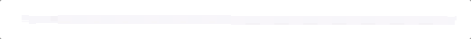
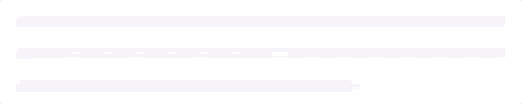
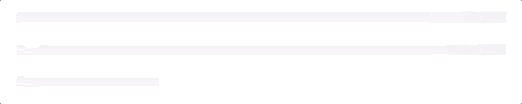
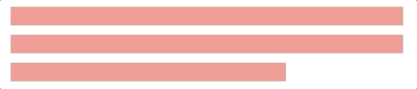

# ActiveLabel

`ActiveLabel` is a `UILabel` subclass that adds horizontal activity indicators to your label while its `text` property is set to `nil`. You can customize this view quite a bit in code or in Interface Builder to fit your specific needs. The purpose of this subclass is to have a visual indication at the label level while you are loading data into labels.

Default Configuration
``` swift
let label: ActiveLabel = ActiveLabel()
```


Custom Configuration
``` swift
let label: ActiveLabel = ActiveLabel()
label.estimatedNumberOfLines = 3
label.finalLineTrailingInset = 100
```


Custom Configuration using convenience initializer.
``` swift
var configuration = ActiveLabelConfiguration.default
configuration.estimatedNumberOfLines = 3
configuration.finalLineLength = 100
configuration.loadingView.animationDuration = 2.0
configuration.loadingView.animationDelay = 0
let label: ActiveLabel = ActiveLabel(frame: CGRect(x: 0, y: 0, width: 335, height: 21), configuration: configuration)
```


Add some color, change line height and spacing.
``` swift
let label: ActiveLabel = ActiveLabel()
label.estimatedNumberOfLines = 3
label.finalLineTrailingInset = 100
label.loadingView.color = UIColor(red: 233.0/255.0, green: 231.0/255.0, blue: 237.0/255.0, alpha: 1.0))
label.loadingView.lineHeight = 16
label.loadingView.lineVerticalSpacing = 8
```


When initializing `ActiveLabel` in Storyboards or Xibs you must set the labels text to `nil` in code because IB initializes labels with an empty string value.

When using `ActiveLabel` for snapshot tests you can center the gradient by calling `configureForSnapshotTest()` on your label.
