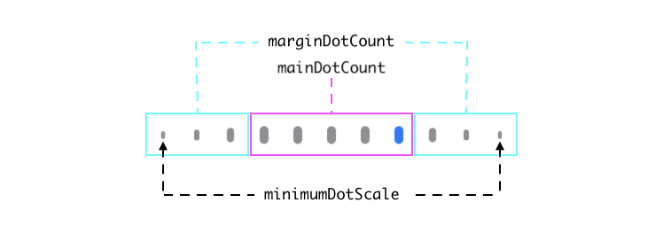
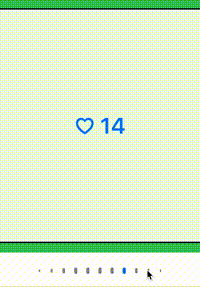

# ScrollingPageControl

`ScrollingPageControl` is a view modeled from (but not a subclass of) Apple's `UIPageControl`. The intent of this class is to allow representation of a large number of pages in a limited space and provide more customization than is possible with `UIPageControl`.

Default Configuration, UIPageControl similarities
``` swift
let pageControl: ScrollingPageControl = ScrollingPageControl()
pageControl.numberOfPages = 30                          // default is 0
pageControl.currentPage = 14                            // default is 0
pageControl.hidesForSinglePage = false                  // default
pageControl.pageIndicatorTintColor = .systemGray        // default
pageControl.currentPageIndicatorTintColor = .systemBlue // default
```


Customize dot layout
``` swift
pageControl.mainDotCount = 5                           // default is 3
pageControl.marginDotCount = 3                         // default is 2
pageControl.dotSize = CGSize(width: 5.0, height: 10.0) // default is 7.0 x 7.0
pageControl.dotSpacing = 14.0                          // default is 9.0
pageControl.minimumDotScale = 0.25                     // default is 0.4
```


Responding to ScrollingPageControl interaction
``` swift
pageControl.didSetCurrentPage = { [weak self] (index) in
    self?.scrollToPageAtIndex(index)
}
```


Adding custom page dots
``` swift
pageControl.customPageDotAtIndex = { [weak self] (index) in
    guard self?.pageData[index].isFavorited else { return nil }
    return FavoriteIconView()
}
```


Usage notes:
- Returning `nil` for an `index` in the `customPageDotAtIndex` block will default to the standard page dot at the specified `dotSize` for that index.
- It's advised that any custom view returned from this block should respond to `tintColorDidChange()` in a way that makes it clear when it is/is not the `currentPage`.
- It's advised that any custom view returned from this block should take `dotSize` and `dotSpacing` into account to maintain a uniform look and feel.
- Anytime the data used in this block gets updated after it is initially set, `updateDot(at:)` or `updateDots(at:)` should be called to keep the page control in sync.
