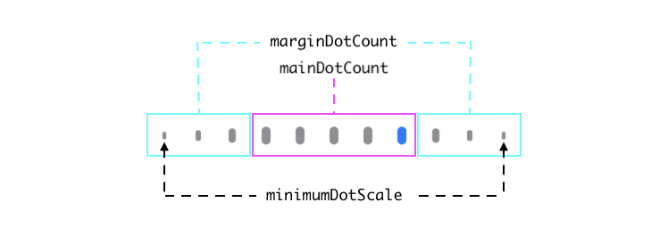
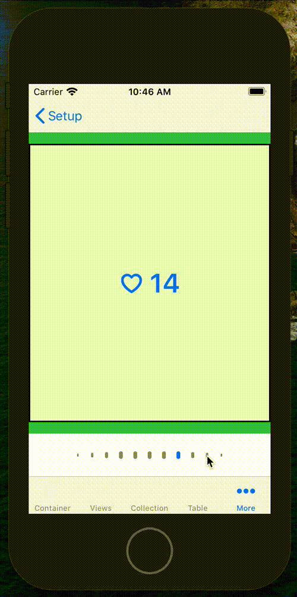

UtiliKit
============

[](http://cocoapods.org/pods/UtiliKit)
[](https://github.com/Carthage/Carthage)
[](http://cocoapods.org/pods/UtiliKit)
[](http://cocoapods.org/pods/UtiliKit)
[](https://codecov.io/gh/BottleRocketStudios/iOS-UtiliKit)
[](https://codebeat.co/projects/github-com-bottlerocketstudios-ios-utilikit-master)

## Purpose

This library provides several useful and often common additions for iOS applications. These extensions, protocols, and structs are designed to simplify boilerplate code as well as remove common "Stringly-typed" use cases.

## Key Concepts

This library is divided into 7 parts, which are available as CocoaPods subspecs.
* **Instantiation** - This subspec changes "Stringly-typed" view instantiation, view controller instantiation, and reusable view dequeuing into type-safe function calls.
* **General** - This subspec includes extensions for both `FileManager` and `UIView`. These simplify getting common URLs and programmatically adding views down to simple variables and function calls.
* **Version** - This subspec simplifies the display of version and build numbers.
* **TimelessDate** - This subspec is an abstraction away from `Date` and `Calendar`. It is primarily designed to be used for simple scheduling and day comparisons in which the time is less important that the actual day.
* **Container** - This subspec provides a simple `ContainerViewController` without any built-in navigation construct.
* **ActiveLabel** - This subspec provides a `UILabel` subclass that renders gradient "loading" animations while the label's `text` property is set to `nil`.
* **Obfuscation** - This subspec provides simple routines to remove plaintext passwords or keys from your source code.

## Usage

### Instantiation

#### Reusable Views

Registering and dequeuing cells, collection view supplementary views, table view headers and footers, and annotations is as simple as calling register on their presenting view, and dequeuing them in the collectionView(_:, cellForItemAt:) -> UICollectionViewCell, or equivalent, function.

``` swift
class ViewController: UIViewController {
    @IBOutlet var collectionView: UICollectionView!
    let dataA: [Int] = [0, 1, 2]
    let dataB: [Int] = [0, 1, 2]
    let dataC: [Int] = [0, 1, 2]
    var data: [[Int]] = []

    override func viewDidLoad() {
        super.viewDidLoad()

        collectionView.register(ProgrammaticCell.self)
        collectionView.registerHeaderFooter(ProgrammaticHeaderFooterView.self)
        collectionView.delegate = self
        collectionView.dataSource = self
    }
}

// MARK: - UICollectionViewDataSource
extension ViewController: UICollectionViewDataSource {

    public func collectionView(_ collectionView: UICollectionView, numberOfItemsInSection section: Int) -> Int {
        return data[section].count
    }

    public func numberOfSections(in collectionView: UICollectionView) -> Int {
        return data.count
    }

    public func collectionView(_ collectionView: UICollectionView, cellForItemAt indexPath: IndexPath) -> UICollectionViewCell {
        // Dequeue a "ProgrammaticCell" from the collection view using only the cell type
        let cell: ProgrammaticCell = collectionView.dequeueReusableCell(for: indexPath)
        return cell
    }

    func collectionView(_ collectionView: UICollectionView, viewForSupplementaryElementOfKind kind: String, at indexPath: IndexPath) -> UICollectionReusableView {

        // You need only provide the desired type and SupplementaryElementKind to receive a typed UICollectionReusableView
        switch kind {
        case UICollectionElementKindSectionHeader:
            let header: ProgrammaticHeaderFooterView = collectionView.dequeueReusableSupplementaryView(of: .sectionHeader, for: indexPath)
            return header
        default:
            let footer: ProgrammaticHeaderFooterView = collectionView.dequeueReusableSupplementaryView(of: .sectionFooter, for: indexPath)
            footer.kind = .sectionFooter
            return footer
        }
    }
}

// MARK: - UICollectionViewDelegateFlowLayout
extension ViewController: UICollectionViewDelegateFlowLayout {

    func collectionView(_ collectionView: UICollectionView, layout collectionViewLayout: UICollectionViewLayout, sizeForItemAt indexPath: IndexPath) -> CGSize {
        return CGSize(width: collectionView.bounds.width, height: 100)
    }

    func collectionView(_ collectionView: UICollectionView, layout collectionViewLayout: UICollectionViewLayout, referenceSizeForHeaderInSection section: Int) -> CGSize {
        return CGSize(width: collectionView.bounds.width, height: 50)
    }

    func collectionView(_ collectionView: UICollectionView, layout collectionViewLayout: UICollectionViewLayout, referenceSizeForFooterInSection section: Int) -> CGSize {
        return CGSize(width: collectionView.bounds.width, height: 25)
    }
}
```

#### View Controllers

In order to instantiate a view controller from a storyboard you simply need to create a Storyboard.Identifier for the storyboard and define the return type.
A simple implementation might look like this:

``` swift
extension UIStoryboard.Identifier {

    static let myStoryboard = UIStoryboard.Identifier(name: "MyStoryboard")
}

class ViewController: UIViewController {

    func presentMyViewController() {
        let vc: MyViewController = UIStoryboard(identifier: .myStoryboard).instantiateViewController()
        present(vc, animated: true)
    }
}
```

### General

#### FileManager Extensions

There are several convenience methods provided as an extension on `FileManager`:

```swift
let documentsDirectory = FileManager.default.documentsDirectory
let cachesDirectory = FileManager.default.cachesDirectory
let appSupportDirectory = FileManager.default.applicationSupportDirectory
let sharedContainerURL = FileManager.default.sharedContainerURL(forSecurityApplicationGroupIdentifier: "com.app.group")
```

#### UIView Extensions

There are several convenience methods provided as an extension on `UIView`, mostly for easily constraining subviews to their parent view:

```swift
let myView = UIView(frame: .zero)
view.addSubview(myView, constrainedToSuperview: true)

let anotherView = UIView(frame: .zero)
anotherView.translatesAutoresizingMaskIntoConstraints = false
view.addSubview(anotherView)

let insets = UIEdgeInsets(top: 10, left: 0, bottom: 10, right: 0)
anotherView.constrainEdgesToSuperview(with: insets)
```

### Version Numbers

Getting version numbers into user facing strings only requires a function call. *Note this function throws an error if the provided version config contains an invalid key.
A simple implementation might look like this:

``` swift
func printVersions() {
    do {
        let customVersionString = try Bundle.main.versionString(for: MyVersionConfig(), isShortVersion: false)
        let verboseVersionString = try Bundle.main.verboseVersionString()
        let versionString = try Bundle.main.versionString()

        print(customVersionString)
        print(verboseVersionString)
        print(versionString)
    } catch {
        print(error)
    }
}
```

### Timeless Dates

A Timeless Date is a simple abstraction the removes the time from a Date and uses Calendar for calculations. This is especially useful for calendar and travel use cases as seeing how many days away something is often is more important that the number of hours between them / 24.

``` swift
func numberOfDaysBetween(start: TimelessDate, finish: TimelessDate) -> DateInterval {
    return start.dateIntervalSince(finish)
}

func isOneWeekFrom(checkout: TimelessDate) -> Bool {
    return checkout.dateIntervalSince(TimelessDate()) <= 7
}
```

This struct also removes the imprecise calculations of adding days, hours, minutes, and seconds to a date and replaces them with Calendar calculations.

``` swift
func addOneHourTo(date: Date) -> Date {
    return date.adding(hours: 1)
}
```

### ContainerViewController

A solution for managing multiple child view controllers, the ContainerViewController manages the lifecycle of the child controllers. This allows you to focus on the navigational structure of your views as well as the transitions between them.

``` swift
containerViewController.managedChildren = [Child(identifier: "A", viewController: controllerA), Child(identifier: "B", viewController: controllerB)]

containerViewController.willMove(toParent: self)

addChild(containerViewController)
containerView.addSubview(containerViewController.view)
containerViewController.view.frame = containerView.bounds

containerViewController.didMove(toParent: self)
```

At this point, transitioning between the children of the container is incredibly simple.

``` swift
let child = ...
containerViewController.transitionToController(for: child)
```

The container also has several delegate callbacks which can help customize its behavior. Among them, is a function which returns a UIViewControllerAnimatedTransitioning object.

``` swift
func containerViewController(_ container: ContainerViewController, animationControllerForTransitionFrom source: UIViewController, to destination: UIViewController) -> UIViewControllerAnimatedTransitioning? {
    if useCustomAnimator, let sourceIndex = container.index(ofChild: source), let destinationIndex = container.index(ofChild: destination) {
        return WipeTransitionAnimator(withStartIndex: sourceIndex, endIndex: destinationIndex)
    }

    return nil
}
```

### ActiveLabel

`ActiveLabel` is a `UILabel` subclass that adds horizontal activity indicators to your label while its `text` property is set to `nil`. You can customize this view quite a bit in code or in Interface Builder to fit your specific needs. The purpose of this subclass is to have a visual indication at the label level while you are loading data into labels.

Default Configuration
``` swift
let label: ActiveLabel = ActiveLabel()
```


Custom Configuration
``` swift
let label: ActiveLabel = ActiveLabel()
label.estimatedNumberOfLines = 3
label.finalLineTrailingInset = 100
```


Custom Configuration using convenience initializer.
``` swift
var configuration = ActiveLabelConfiguration.default
configuration.estimatedNumberOfLines = 3
configuration.finalLineLength = 100
configuration.loadingView.animationDuration = 2.0
configuration.loadingView.animationDelay = 0
let label: ActiveLabel = ActiveLabel(frame: CGRect(x: 0, y: 0, width: 335, height: 21), configuration: configuration)
```


Add some color, change line height and spacing.
``` swift
let label: ActiveLabel = ActiveLabel()
label.estimatedNumberOfLines = 3
label.finalLineTrailingInset = 100
label.loadingView.color = UIColor(red: 233.0/255.0, green: 231.0/255.0, blue: 237.0/255.0, alpha: 1.0))
label.loadingView.lineHeight = 16
label.loadingView.lineVerticalSpacing = 8
```


When initializing `ActiveLabel` in Storyboards or Xibs you must set the labels text to `nil` in code because IB initializes labels with an empty string value.

When using `ActiveLabel` for snapshot tests you can center the gradient by calling `configureForSnapshotTest()` on your label.


### ScrollingPageControl

`ScrollingPageControl` is a view modeled off of (but not a subclass of) Apple's `UIPageControl`. The intent of this class is to allow representation of a large number of pages in a limited space and provide more customization than is possible with `UIPageControl`.

Default Configuration, UIPageControl similarities
``` swift
let pageControl: ScrollingPageControl = ScrollingPageControl()
pageControl.numberOfPages = 30                          // default is 0
pageControl.currentPage = 14                            // default is 0
pageControl.hidesForSinglePage = false                  // default
pageControl.pageIndicatorTintColor = .systemGray        // default
pageControl.currentPageIndicatorTintColor = .systemBlue // default
```


Customize dot layout
``` swift
pageControl.mainDotCount = 5                           // default is 3
pageControl.marginDotCount = 3                         // default is 2
pageControl.dotSize = CGSize(width: 5.0, height: 10.0) // default is 7.0 x 7.0
pageControl.dotSpacing = 14.0                          // default is 9.0
pageControl.minimumDotScale = 0.25                     // default is 0.4
```


Responding to ScrollingPageControl interaction
``` swift
pageControl.didSetCurrentPage = { [weak self] (index) in
    self?.scrollToPageAtIndex(index)
}
```


Adding custom page dots
``` swift
pageControl.customPageDotAtIndex = { [weak self] (index) in
    guard self?.pageData[index].isFavorited else { return nil }
    return FavoriteIconView()
}
```
Usage notes:
- Returning `nil` for an `index` in the `customPageDotAtIndex` block will default to the standard page dot at the specified `dotSize` for that index.
- It's advised that any custom view returned from this block should respond to `tintColorDidChange()` in a way that makes it clear when it is/is not the `currentPage`.
- It's advised that any custom view returned from this block should take `dotSize` and `dotSpacing` into account to maintain a uniform look and feel.
- Anytime the data used in this block gets updated after it is initially set, `updateDot(at:)` or `updateDots(at:)` should be called to keep the page control in sync.


### ObfuscatedKey

To use an obfuscated key in your code, create one and use the builder variables to encode your key.

``` swift
let key = ObfuscatedKey().T.h.i.s.underscore.I.s.dash.o.b.f.u.s.c.a.t.e.d.value
```

## Example

To run the example project, clone the repo, open `UtiliKit.xcworkspace`, and run the "UtiliKit-iOSExample" project.

## Requirements

* iOS 10.0+
* Swift 5.0

## Installation - Swift Package Manager

```swift
dependencies: [
    .package(url: "https://github.com/BottleRocketStudios/iOS-UtiliKit.git", from: "1.6.0")
]
```

You will then need to choose from the available libraries to add to your project. These libraries should match up with the subspecs available through Cocoapods.

* `UtiliKit` - Imports all of the below libraries available individually.
* `GeneralUtilities` - This subspec includes extensions for both `FileManager` and `UIView`. These simplify getting common URLs and programmatically adding views down to simple variables and function calls.
* `Instantiation` - This subspec changes "Stringly-typed" view instantiation, view controller instantiation, and reusable view dequeuing into type-safe function calls.
* `TimelessDate` - This subspec is an abstraction away from `Date` and `Calendar`. It is primarily designed to be used for simple scheduling and day comparisons in which the time is less important that the actual day.
* `Versioning` - This subspec simplifies the display of version and build numbers.
* `ContainerViewController` - This subspec provides a simple `ContainerViewController` without any built-in navigation construct.
* `ActiveLabel` - This subspec provides a `UILabel` subclass that renders gradient "loading" animations while the label's `text` property is set to `nil`.
* `Obfuscation` - This subspec provides simple routines to remove plaintext passwords or keys from your source code.

## Installation - CocoaPods

[CocoaPods]: http://cocoapods.org

Add the following to your [Podfile](http://guides.cocoapods.org/using/the-podfile.html):

```ruby
pod 'UtiliKit'
```

You will also need to make sure you're opting into using frameworks:

```ruby
use_frameworks!
```

Then run `pod install` with CocoaPods 0.36 or newer.

## Installation - Carthage

Add the following to your [Cartfile](https://github.com/Carthage/Carthage/blob/master/Documentation/Artifacts.md#cartfile):

```
github "BottleRocketStudios/iOS-UtiliKit"
```

Run `carthage update` and follow the steps as described in Carthage's [README](https://github.com/Carthage/Carthage#adding-frameworks-to-an-application).

## Contributing

See the [CONTRIBUTING] document. Thank you, [contributors]!

[CONTRIBUTING]: CONTRIBUTING.md
[contributors]: https://github.com/BottleRocketStudios/iOS-UtiliKit/graphs/contributors
